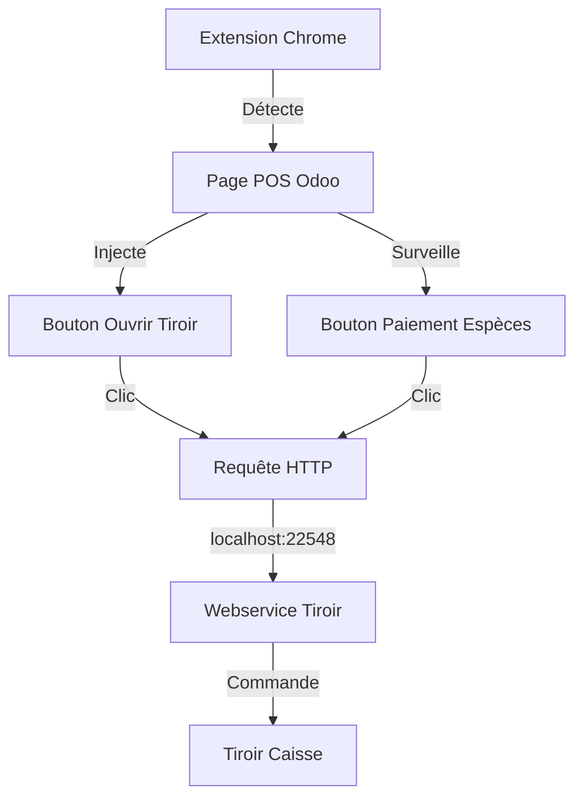

# 📋 Cahier des Charges : Extension Chrome Odoo POS Cash Drawer

## 🎯 Objectif du Projet

Développer une extension Chrome permettant l'automatisation de l'ouverture du tiroir-caisse dans l'interface Point de Vente (POS) d'Odoo, améliorant ainsi l'efficacité opérationnelle des commerces utilisant Odoo.

## 🔍 Contexte

Les utilisateurs d'Odoo POS ont besoin d'une solution simple et efficace pour ouvrir leur tiroir-caisse directement depuis l'interface POS, particulièrement lors des transactions en espèces. Cette extension vient combler ce besoin en automatisant le processus.

### ⚡ Points Clés
- 🔐 Aucune modification du code Odoo requise
  - Extension purement navigateur
  - Pas d'installation de module Odoo nécessaire
  - Préservation de l'intégrité du système POS
- ✅ Compatible avec la certification caisse
  - Ne modifie pas le comportement natif de la caisse
  - Ajoute uniquement des fonctionnalités d'interface
  - Maintient la conformité réglementaire

## 💫 Fonctionnalités Principales

### 1. Interface Utilisateur
- ✨ Ajout d'un bouton "Ouvrir Tiroir" dans l'interface POS
  - Design cohérent avec l'interface Odoo
  - Icône intuitive (fa-cash-register)
  - Intégration harmonieuse dans la barre de contrôle

### 2. Automatisation
- 🔄 Ouverture automatique lors des paiements en espèces
- 🎯 Détection intelligente de la page POS
- 🔌 Injection dynamique des éléments d'interface

### 3. Compatibilité
- 🌐 Support de toutes les instances Odoo version 17 (cloud et auto-hébergées)
- 💻 Fonctionne sur Google Chrome
- 🔗 Communication avec le webservice local (port 22548)

### 4. Sécurité
- 🔒 Permissions limitées (activeTab, scripting)
- 🛡️ Communication sécurisée avec le webservice
- 🔐 Mode no-cors pour la compatibilité cross-origin

## 🛠️ Spécifications Techniques

### Architecture

### Composants
1. **Content Script (content.js)**
   - Détection de la page POS
   - Injection du bouton
   - Gestion des événements
   - Communication avec le webservice

2. **Manifest (manifest.json)**
   - Version : 3
   - Permissions requises
   - Configuration des scripts
   - Définition des permissions d'hôtes

### Communication
1. **Avec le Webservice**
   - Protocole : HTTP
   - Méthode : GET
   - Endpoint : http://localhost:22548/open-cash-drawer
   - Mode : no-cors

2. **Avec l'Interface POS**
   - Observation des mutations DOM
   - Détection des événements de clic
   - Injection dynamique d'éléments UI

## 📊 Logging et Débogage

### Logs Console
- 📝 Chargement de l'extension
- 📝 Détection de la page POS
- 📝 Tentatives d'injection
- 📝 Succès/échec des opérations
- 📝 Erreurs et exceptions

## 🔄 Cycle de Vie

1. **Initialisation**
   - Chargement de l'extension
   - Vérification de la page POS
   - Tentatives d'injection du bouton

2. **Fonctionnement**
   - Surveillance continue du DOM
   - Réaction aux événements utilisateur
   - Communication avec le webservice

3. **Gestion des Erreurs**
   - Tentatives multiples d'injection
   - Logging des erreurs
   - Mécanismes de repli

## 📈 Évolutions Futures

### Version 1.1
- [ ] Interface de configuration
  - URL du webservice personnalisable
  - Options de logging configurables
  - Personnalisation de l'interface

### Version 1.2
- [ ] Statistiques d'utilisation
  - Nombre d'ouvertures
  - Taux de succès
  - Temps de réponse

### Version 1.3
- [ ] Support des raccourcis clavier
  - Touches personnalisables
  - Combinaisons multiples
  - Mode avancé

## 🔧 Prérequis Techniques

### Environnement de Développement
- 🔨 Google Chrome (dernière version)
- 🔨 Node.js pour le développement
- 🔨 Accès au webservice local

### Dépendances
- 📦 [Webservice tiroir-caisse](https://github.com/ralphi2811/odoo_pos_cashdrawer_webservice)
  - Service local requis pour la communication avec le tiroir
  - Installation et configuration nécessaire
  - Port 22548 par défaut
- 📦 Instance Odoo avec module POS
- 📦 Font Awesome (pour les icônes)

> ⚠️ **Important** : Cette extension nécessite l'installation et la configuration du [webservice associé](https://github.com/ralphi2811/odoo_pos_cashdrawer_webservice) pour fonctionner. Le webservice gère la communication directe avec le tiroir-caisse via l'imprimante ticket.

## 📝 Documentation

La documentation complète (README) inclut :
- 📚 Guide d'installation
- 📚 Manuel utilisateur
- 📚 Guide de débogage
- 📚 Documentation technique
- 📚 Guide de contribution

## ⚖️ Licence

Ce projet est distribué sous licence MIT, permettant :
- ✅ Utilisation commerciale
- ✅ Modification
- ✅ Distribution
- ✅ Utilisation privée

---
Raphaël Auberlet
*Document généré le 20/02/2025*
